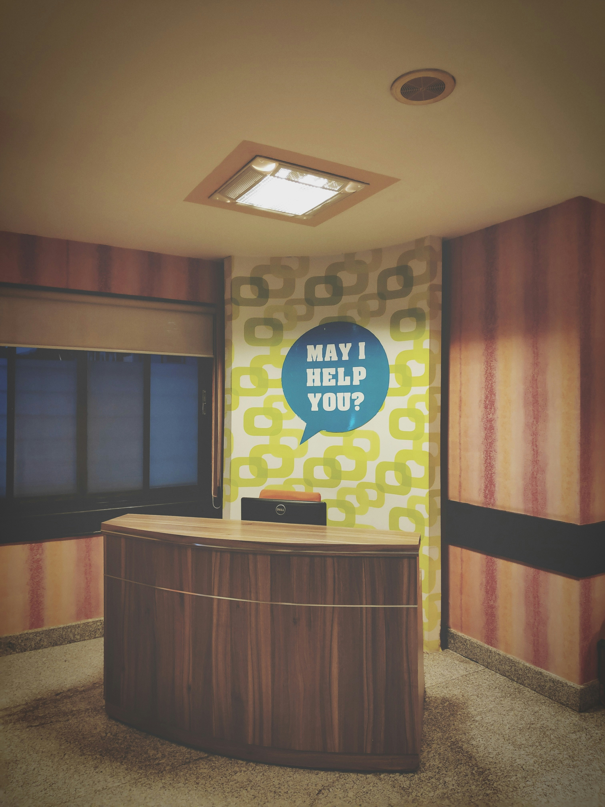

# Whitney's Woebegone Waypoint & Emporium
## A choose your own adventure game!

## Introduction
This is a fairly basic choose your adventure game. The user progresses through the various rooms to find the silver key and unlock the treasure! When I was reading through the project this type of game was the first that popped into my head. I do some writing on the side and felt I could put together something fun!

## Deployed Game
[Whitney's Woebegone Waypoint & Emporium] https://mhurst66.github.io/super-adventure-game/
To play the game click through the various doors to progress through the story.
I was able to blend Javascript, HTML, and CSS to create a structure and then dynamically change the structure throughout the story.

## Project Planning
Here is a link to the document I used to help plan the project. This is a rough draft and some things in here did not make it into the final copy.

[Adventure Game] https://docs.google.com/document/d/1ZYkB5rZGkXbG3K49Nlsa1Q6G5gwaKhlgZU82T-MU4K0/edit?usp=sharing

## Future Goals
Unfortunately, due to time constraints I was unable to figure out the code to have my doors display pictures and that would be my biggest new plan.
Additionally, at the beginning of the project I had larger goals about creating puzzles, and other interesting features. However, to finish the MVP by the deploy date, I had to cut back.
Lastly I would adjust the CSS to make it more mobile friendly!